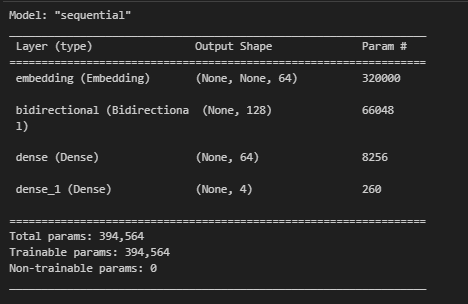
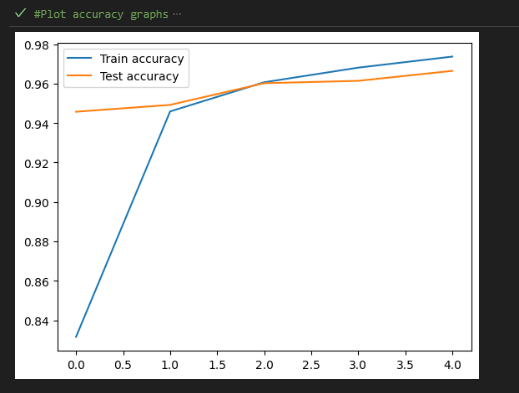
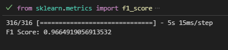
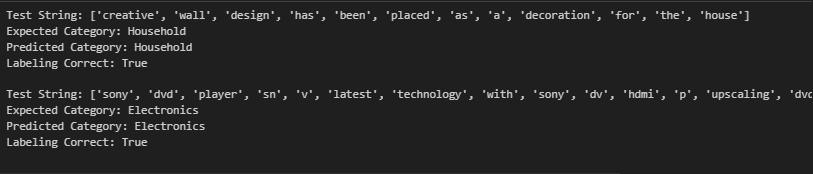

# Multiclass text classification
## Project detail
The project is about training a model in which it will colect the crucial information from the text document and categorized it according to the given categories which is "Electronics”, "Household”, "Books”, and “Clothing & Accessories”.
One of the challenge that I faced is to clean the data in which first of all need to detect whether there is a Nan calues in the data. The Nan values need to be eliminated first before proceeding with the project.
After we have eliminated the Nan values then we can proceed with the preprocessing data. In this step, the unwanted strings such as ".*?" and white spaces is eliminated.
It will also undergo tokenization and padding and truncating before the development of the model. 
The model then will be compiled, trained and evaluated before being deployed.
## Guide
The user needs download the project. 
The saved model is provided and also the tokenizer.
In the project code, the user needs to provide a text documents which should be saved as a string format.
The string will undergo process to remove unwanted strings and will be tokenized. It also will undergo padding before making the prediction.
## Output of the project
- This is the model architecture 

- This is the accuracy grapgh after undergoes the training

- This the f1-score obtained

- This is when the model is deployed. It is tested with two text documents and these is the outputs.

## Credits for the dataset 
URL- https://www.kaggle.com/datasets/saurabhshahane/ecommerce-text-classification